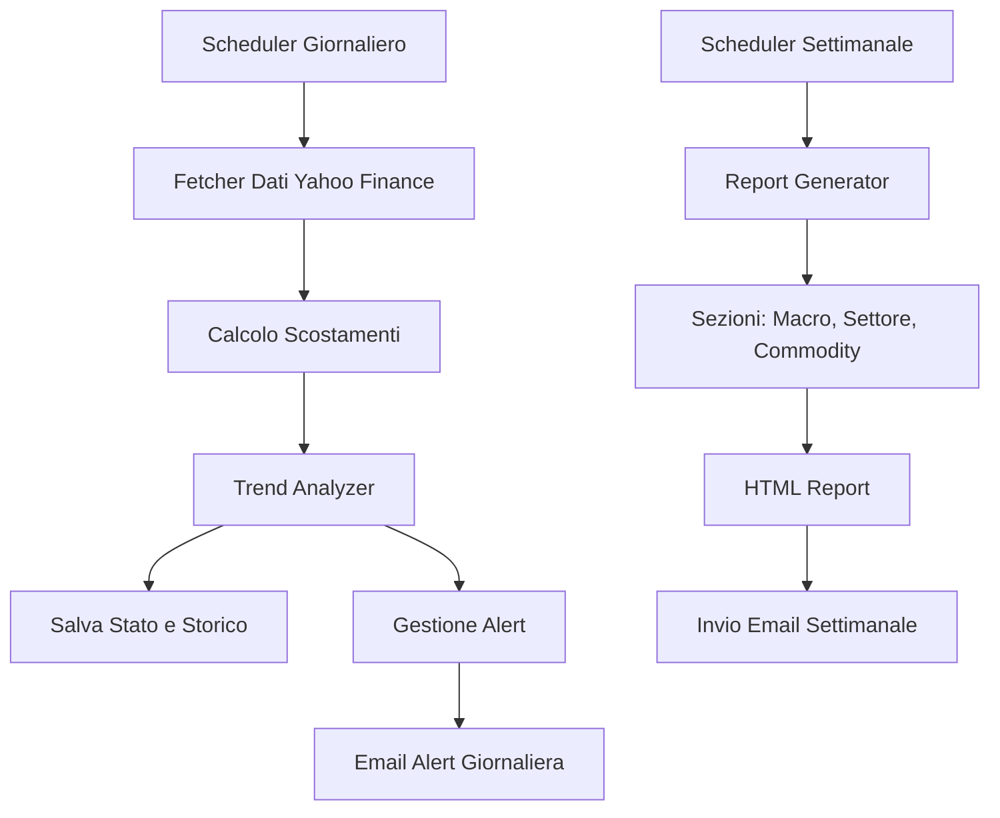

# 📈 Schema a Blocchi (Mermaid)

```mermaid
graph TD
  A[Scheduler Giornaliero] --> B[Fetcher Dati Yahoo Finance]
  B --> C[Calcolo Scostamenti]
  C --> D[Trend Analyzer]
  D --> E[Salva Stato e Storico]
  D --> F[Gestione Alert]
  F --> G[Email Alert Giornaliera]

  A2[Scheduler Settimanale] --> H[Report Generator]
  H --> I[Sezioni: Macro, Settore, Commodity]
  I --> J[HTML Report]
  J --> K[Invio Email Settimanale]
```